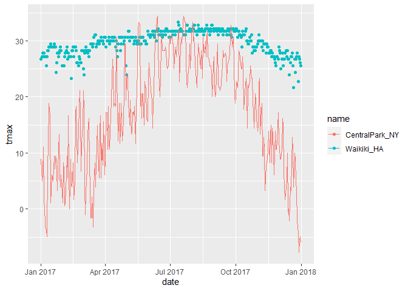
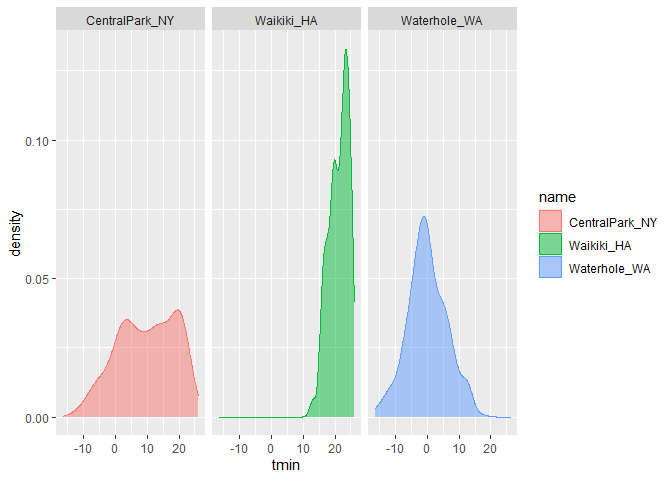
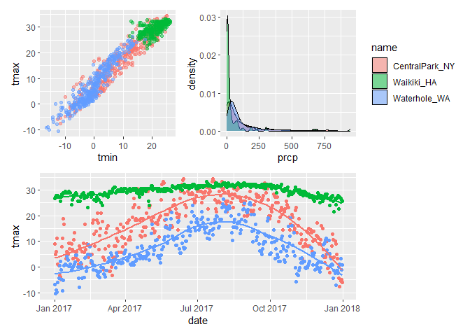

viz\_and\_eda
================
Shelley Shen
10/6/2020

``` r
weather_df = 
  rnoaa::meteo_pull_monitors(
    c("USW00094728", "USC00519397", "USS0023B17S"),
    var = c("PRCP", "TMIN", "TMAX"), 
    date_min = "2017-01-01",
    date_max = "2017-12-31") %>%
  mutate(
    name = recode(
      id, 
      USW00094728 = "CentralPark_NY", 
      USC00519397 = "Waikiki_HA",
      USS0023B17S = "Waterhole_WA"),
    tmin = tmin / 10,
    tmax = tmax / 10) %>%
  select(name, id, everything())
```

    ## Registered S3 method overwritten by 'hoardr':
    ##   method           from
    ##   print.cache_info httr

    ## using cached file: C:\Users\shens\AppData\Local\Cache/R/noaa_ghcnd/USW00094728.dly

    ## date created (size, mb): 2020-10-06 15:19:44 (7.537)

    ## file min/max dates: 1869-01-01 / 2020-10-31

    ## using cached file: C:\Users\shens\AppData\Local\Cache/R/noaa_ghcnd/USC00519397.dly

    ## date created (size, mb): 2020-10-06 15:20:08 (1.703)

    ## file min/max dates: 1965-01-01 / 2020-03-31

    ## using cached file: C:\Users\shens\AppData\Local\Cache/R/noaa_ghcnd/USS0023B17S.dly

    ## date created (size, mb): 2020-10-06 15:20:29 (0.882)

    ## file min/max dates: 1999-09-01 / 2020-10-31

``` r
weather_df
```

    ## # A tibble: 1,095 x 6
    ##    name           id          date        prcp  tmax  tmin
    ##    <chr>          <chr>       <date>     <dbl> <dbl> <dbl>
    ##  1 CentralPark_NY USW00094728 2017-01-01     0   8.9   4.4
    ##  2 CentralPark_NY USW00094728 2017-01-02    53   5     2.8
    ##  3 CentralPark_NY USW00094728 2017-01-03   147   6.1   3.9
    ##  4 CentralPark_NY USW00094728 2017-01-04     0  11.1   1.1
    ##  5 CentralPark_NY USW00094728 2017-01-05     0   1.1  -2.7
    ##  6 CentralPark_NY USW00094728 2017-01-06    13   0.6  -3.8
    ##  7 CentralPark_NY USW00094728 2017-01-07    81  -3.2  -6.6
    ##  8 CentralPark_NY USW00094728 2017-01-08     0  -3.8  -8.8
    ##  9 CentralPark_NY USW00094728 2017-01-09     0  -4.9  -9.9
    ## 10 CentralPark_NY USW00094728 2017-01-10     0   7.8  -6  
    ## # ... with 1,085 more rows

## Remember this plot?

``` r
weather_df %>% 
  ggplot(aes(x = tmin, y = tmax, color = name)) +
  geom_point(alpha = .5)
```

    ## Warning: Removed 15 rows containing missing values (geom_point).

<!-- -->

## Labels

``` r
weather_df %>% 
  ggplot(aes(x = tmin, y = tmax, color = name)) +
  geom_point(alpha = .5) +
  labs(
    title = "Temperature plot",
    x = "Minimum daily temperature (C)",
    y = "Maximum daily temperature (C)", 
    caption = "Data from rnoaa package; temperatures in 2017."
  )
```

    ## Warning: Removed 15 rows containing missing values (geom_point).

<!-- -->

\#3 Scales

Start with the same plot; x and y scales.

``` r
weather_df %>% 
  ggplot(aes(x = tmin, y = tmax)) + 
  geom_point(aes(color = name), alpha = .5) + 
  labs(
    title = "Temperature plot",
    x = "Minimum daily temperature (C)",
    y = "Maxiumum daily temperature (C)",
    caption = "Data from the rnoaa package") + 
  scale_x_continuous(
    breaks = c(-15, 0, 15), 
    labels = c("-15º C", "0", "15")) +
  scale_y_continuous(
    position = "left"
  )
```

    ## Warning: Removed 15 rows containing missing values (geom_point).

<!-- -->

Look at color scales.

``` r
weather_df %>% 
  ggplot(aes(x = tmin, y = tmax)) + 
  geom_point(aes(color = name), alpha = .5) + 
  labs(
    title = "Temperature plot",
    x = "Minimum daily temperature (C)",
    y = "Maxiumum daily temperature (C)",
    caption = "Data from the rnoaa package") + 
  scale_color_hue(
    name = "Location",
    h = c(100, 300)) 
```

    ## Warning: Removed 15 rows containing missing values (geom_point).

<!-- -->

``` r
weather_df %>% 
  ggplot(aes(x = tmin, y = tmax)) + 
  geom_point(aes(color = name), alpha = .5) + 
  labs(
    title = "Temperature plot",
    x = "Minimum daily temperature (C)",
    y = "Maxiumum daily temperature (C)",
    caption = "Data from the rnoaa package") + 
  viridis::scale_color_viridis(
    name = "Location", 
    discrete = TRUE)
```

    ## Warning: Removed 15 rows containing missing values (geom_point).

<!-- -->

## Themes

``` r
weather_df %>% 
  ggplot(aes(x = tmin, y = tmax)) + 
  geom_point(aes(color = name), alpha = .5) + 
  labs(
    title = "Temperature plot",
    x = "Minimum daily temperature (C)",
    y = "Maxiumum daily temperature (C)",
    caption = "Data from the rnoaa package") + 
  viridis::scale_color_viridis(
    name = "Location", 
    discrete = TRUE) +
  theme_minimal() +
  theme(legend.position = "bottom")
```

    ## Warning: Removed 15 rows containing missing values (geom_point).

<!-- -->

## Setting options – for all future documents

``` r
library(tidyverse)

knitr::opts_chunk$set(
  fig.width = 6,
  fig.asp = .6, 
  out.width = "90%"
)

theme_set(theme_minimal() + theme(legend.position = "bottom"))

options(
  ggplot2.continuous.colour = "viridis",
  ggplot2.continuous.fill = "viridis"
)

scale_colur_discrete = scale_color_viridis_d
scale_fill_discrete = sclae_fill_viridis_d
```

## Data args in `geom`

``` r
central_park = 
  weather_df %>% 
  filter(name == "CentralPark_NY")

waikiki = 
  weather_df %>% 
  filter(name == "Waikiki_HA")

ggplot(data = waikiki, aes(x = date, y = tmax, color = name)) +
  geom_point() + 
  geom_line(data = central_park)
```

    ## Warning: Removed 3 rows containing missing values (geom_point).

<!-- -->

## `patchwork`

Remember faceting?

``` r
weather_df %>% 
  ggplot(aes(x = tmin, fill = name, color = name)) + 
  geom_density(alpha = .5) +
  facet_grid(. ~ name)
```

    ## Warning: Removed 15 rows containing non-finite values (stat_density).

<!-- -->

What happens when you want multipanel plots but can’t facet?

``` r
tmax_tmin_p = 
  weather_df %>% 
  ggplot(aes(x = tmin, y = tmax, color = name)) +
  geom_point(alpha = .5) + 
  theme(legend.position = "none")

prcp_dens_p = 
  weather_df %>%
  filter(prcp > 0) %>% 
  ggplot(aes(x = prcp, fill = name)) +
  geom_density(alpha = .5)


tmax_date_p = 
  weather_df %>% 
  ggplot(aes(x = date, y = tmax, color = name)) +
  geom_point() +
  geom_smooth(se = FALSE) +
  theme(legend.position = "none")

(tmax_tmin_p + prcp_dens_p) / tmax_date_p
```

    ## Warning: Removed 15 rows containing missing values (geom_point).

    ## `geom_smooth()` using method = 'loess' and formula 'y ~ x'

    ## Warning: Removed 3 rows containing non-finite values (stat_smooth).

    ## Warning: Removed 3 rows containing missing values (geom_point).

<!-- -->

## Data Manipulation

Control your factors (variable types)

``` r
weather_df %>% 
  mutate(
   name = factor(name),
   name = forcats::fct_relevel(name,c("Waikiki_HA"))
  ) %>% 
  ggplot(aes(x = name, y = tmax, fill = name)) +
  geom_violin(alpha = .5)
```

    ## Warning: Removed 3 rows containing non-finite values (stat_ydensity).

<!-- -->

What if I wanted densities for tmin and tmax simultaneously?

``` r
weather_df %>% 
  pivot_longer(
    tmax:tmin,
    names_to = "observation",
    values_to = "temperatures"
  ) %>% 
  ggplot(aes(x = temperatures, fill = observation)) +
  geom_density(alpha = .5) +
  facet_grid(. ~ name)
```

    ## Warning: Removed 18 rows containing non-finite values (stat_density).

<!-- -->

## Revisit the pups

Data from the FAS study.

``` r
pups_data = 
  read_csv("./data/FAS_pups.csv") %>% 
  janitor::clean_names() %>% 
  mutate(sex = recode(sex, `1` = "male", `2` = "female"))
```

    ## Parsed with column specification:
    ## cols(
    ##   `Litter Number` = col_character(),
    ##   Sex = col_double(),
    ##   `PD ears` = col_double(),
    ##   `PD eyes` = col_double(),
    ##   `PD pivot` = col_double(),
    ##   `PD walk` = col_double()
    ## )

``` r
litters_data = 
  read_csv("./data/FAS_litters.csv") %>%
  janitor::clean_names() %>% 
  separate(group, into = c("dose", "day_of_tx"), sep = 3)
```

    ## Parsed with column specification:
    ## cols(
    ##   Group = col_character(),
    ##   `Litter Number` = col_character(),
    ##   `GD0 weight` = col_double(),
    ##   `GD18 weight` = col_double(),
    ##   `GD of Birth` = col_double(),
    ##   `Pups born alive` = col_double(),
    ##   `Pups dead @ birth` = col_double(),
    ##   `Pups survive` = col_double()
    ## )

``` r
fas_data = left_join(pups_data, litters_data, by = "litter_number")


fas_data %>% 
  select(dose, day_of_tx, starts_with(("pd_"))) %>% 
  pivot_longer(
    pd_ears:pd_walk,
    names_to = "outcome", 
    values_to = "pn_day"
  ) %>% 
  drop_na() %>% 
  mutate(outcome = 
           forcats::fct_relevel(outcome, "pd_ears", "pd_pivot", "pd_walk", "pd_eyes")) %>% 
  ggplot(aes(x = dose, y = pn_day)) +
  geom_violin() +
  facet_grid(day_of_tx ~ outcome)
```

<!-- -->
